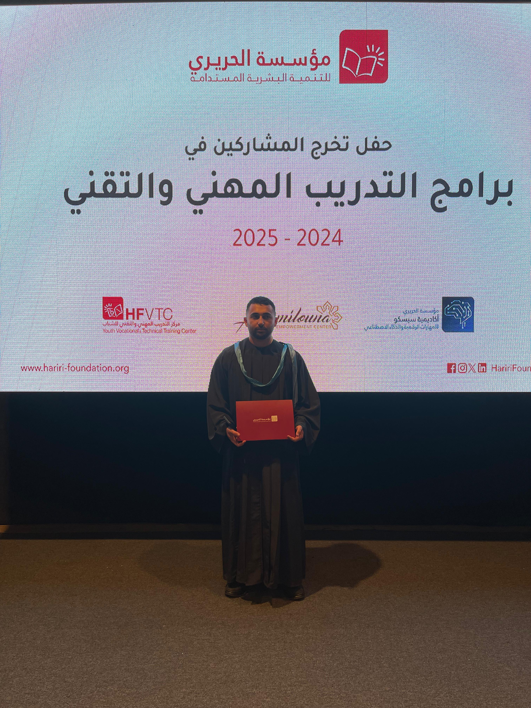



Hey! I am Toni Talej.

I am a telecommunications engineering graduate with a strong interest in technology and open-source systems.
I enjoy working with Linux, especially DevOps-oriented environments, and exploring modern cloud computing technologies. My interests include networking, system infrastructure, and learning how scalable communication and cloud systems are designed and deployed. I am always looking to expand my technical skills and deepen my understanding of telecommunications, Linux systems, and cloud platforms.
